# Kaggle Santa TSP

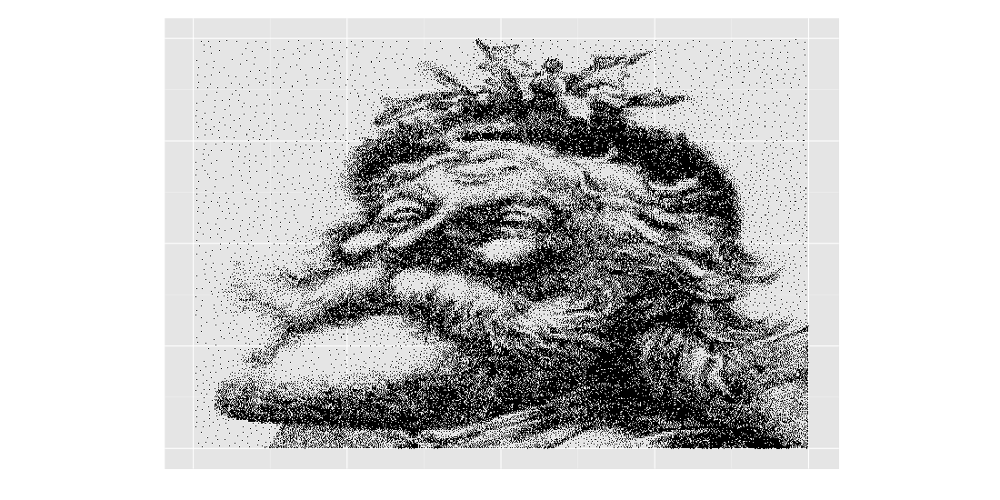

---
# Kaggle Santa TSP

* It's a big problem: **150.000** chimneys

* No only found a path

  - Found two **disjoint** paths: *If one of your paths contains an edge from A to B, your other path must not contain an edge from A to B or from B to A (either order still counts as using that edge)*.
  
  - The final score will be the larger of the two distances.
  
* Strategy:

  1. Find a simple solution, better as possible.

  2. Find the second solution respecting the constraints.

* Lower boundary (sum of the distance of each city to the nearest): **5.405.982**

---
# Use library vs develop it yourself

* In big problems the performance is very important

* The existing libraries execute the fitness function after to apply the operator (no estimate the change)

* I developed local search, tabu search and simulate annealing **to estimate that change**

* I developed ant colony algorithm because **I don't found any implementation** in R

---
# Random solution

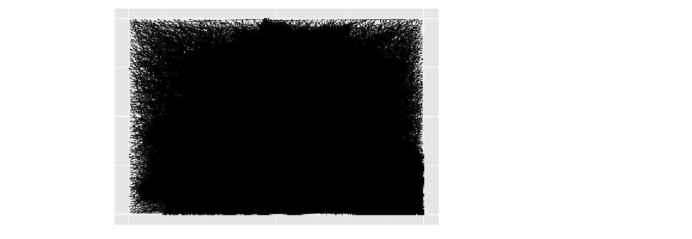

* Aprox. 1.290.000.000

---
# Greddy solution

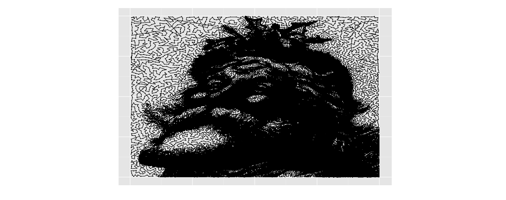

* Fitness: 7.137.517

---
# Kmeans solution

* 80 clusters

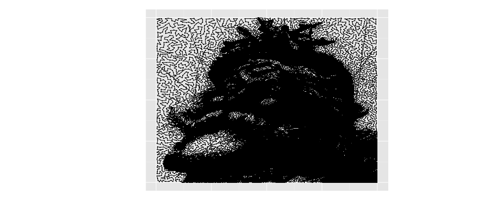

* Fitness: 7.767.374

---
# First attempt

* Try solve to the complete problem with local search using the two-opt operator from the greddy solution.

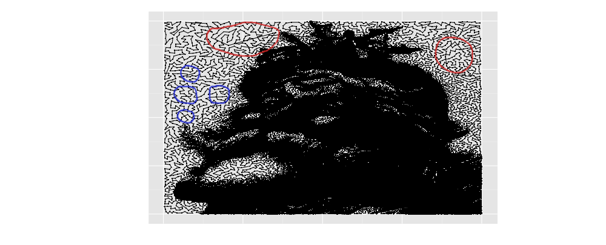

* Fitness: 6.804.530

* The greddy heuristic creates **path-crossings**, some of them are dificult to resolve because involve to many chimneys. 

---
# My Greddy solution

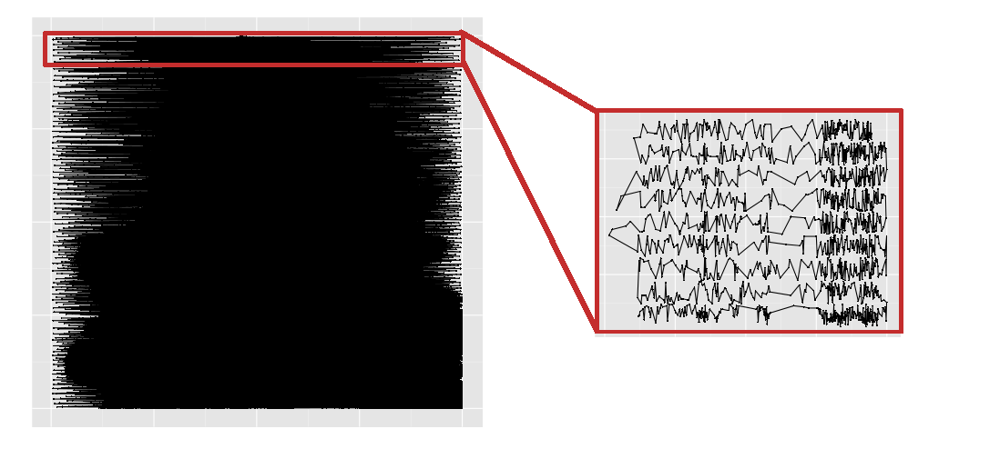

* Fitness: 17.938.005

* There isn't path-crossings! :)

* Better to comparing algorithms

---
# Operators

* neighbour, 2-opt


* angle-Opt, near-Opt


---
# Operators

* reduce_max_dist


---
# Operators

* 100 executions per algorithm and operator, 100 iterations per execution

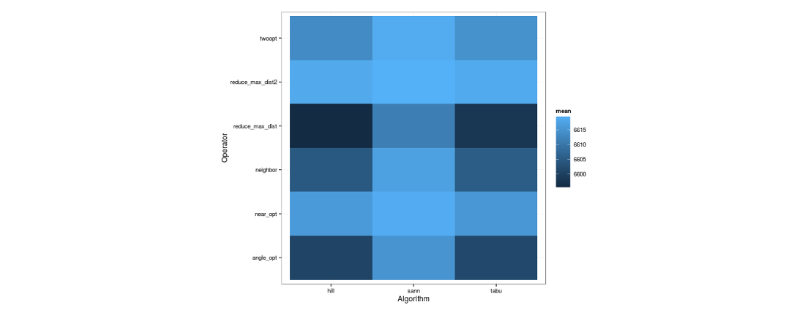


---
# Divide and select a good operator

* Deal with the complete problem is unfeasible (locality, fitness calculate, ...) 

* I don't know when is better use each operator

* So, I use the follow strategy:

```javascript
	1. For each subroute of size m of the current solution

	   1.1. Select an operator (the best score have more probability to be selected)

	   1.2. Apply an algorithm a number of interations

	   1.3. If there is improvement increase the score of the operator, in other case decrease it

	2. If had improvement in any subroute return to 1

```

---
# Parameters

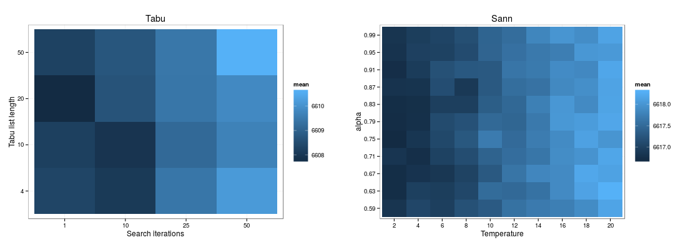

---
# Comparing the final results

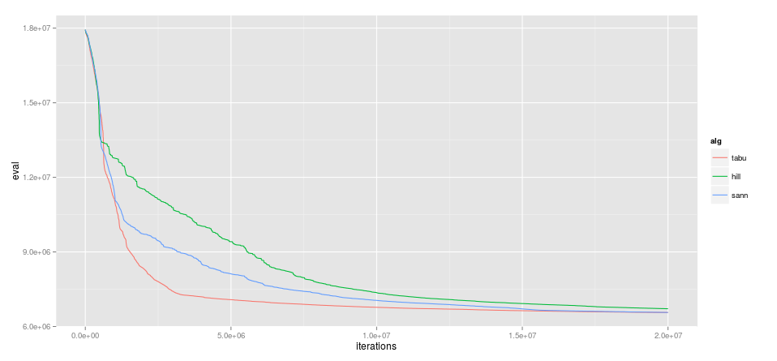

* Better is tabu: 6.486.473

---
# Comparing the final results

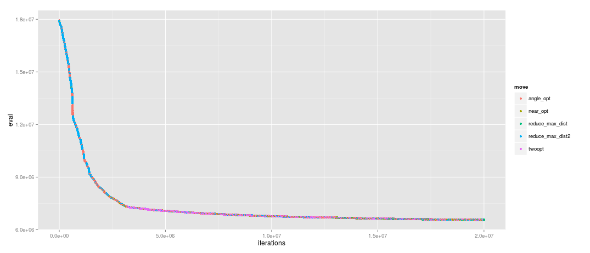

* The algorithms select the operators that get improvings

---
# Using operators 

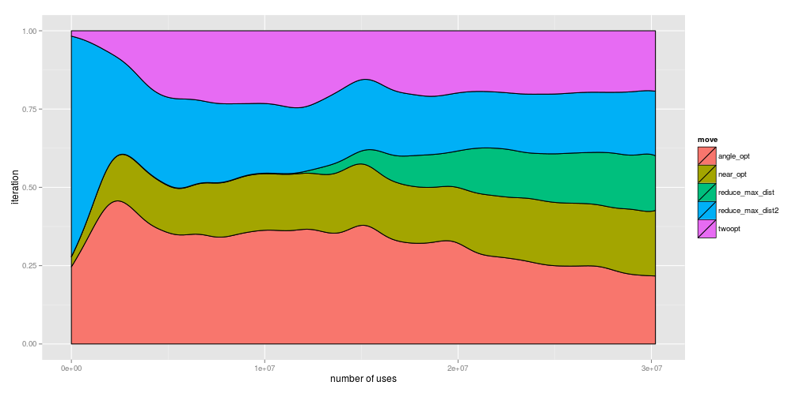

---
# Population algorithms

* In general need more memory and the fitness estimation of the operations are difficult

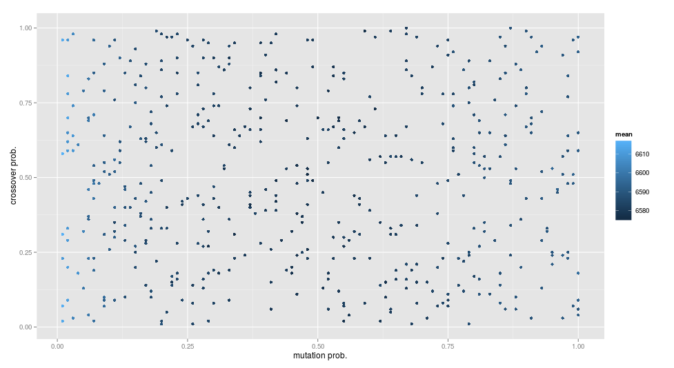

---
# Finding a the second solution

* Create a second solution from the first:


* New fitness function using naive:
```
		G(s) = F(s) + ( F(s)/D ) * 3e
```
* where:

  - D: length of s
  - e: edges coinciding 

---
#  Finding a the second solution


* Fitness: 8.066.495

---
# Final solution

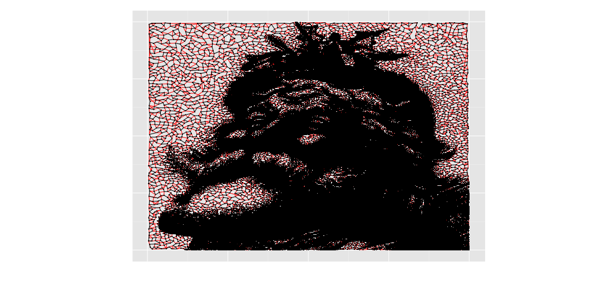

* Fitness: 7.816.935


